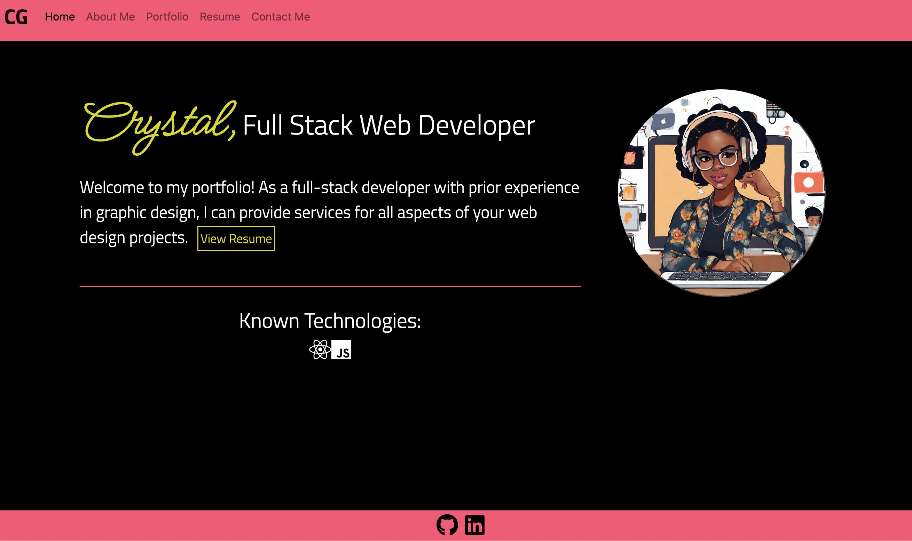

# react-portfolio

[Deployed Site](https://crystalgreen.netlify.app/)

## Description
This project is the most important to me of all of the bootcamp assignments as it encompasses a great deal of what I have learned in the past 6 months.  Making it through this bootcamp has been a true accomplishment and this portfolio shows that the proof is in the pudding!

## Table of Contents

1. [Installation](#installation)
2. [Usage](#usage)
3. [Credits](#credits)
4. [How to Contribute](#how-to-contribute)
5. [Tests](#tests)
6. [Questions](#questions)

## Installation
This code can be cloned via the github repo.  

## Usage
Feel free to use this code as inspiration for your own portfolio or as a starting point.

## Credits
Rutgers tutors and class activities were utilized in the creation of this portfolio.

## How to Contribute
N/A

## Tests
N/A

## License
MIT License
        Copyright (C) 2023 Crystal Green
        Permission is hereby granted, free of charge, to any person obtaining a copy
of this software and associated documentation files (the "Software"), to deal
in the Software without restriction, including without limitation the rights
to use, copy, modify, merge, publish, distribute, sublicense, and/or sell
copies of the Software, and to permit persons to whom the Software is
furnished to do so, subject to the following conditions:

The above copyright notice and this permission notice shall be included in all
copies or substantial portions of the Software.

THE SOFTWARE IS PROVIDED "AS IS", WITHOUT WARRANTY OF ANY KIND, EXPRESS OR
IMPLIED, INCLUDING BUT NOT LIMITED TO THE WARRANTIES OF MERCHANTABILITY,
FITNESS FOR A PARTICULAR PURPOSE AND NONINFRINGEMENT. IN NO EVENT SHALL THE
AUTHORS OR COPYRIGHT HOLDERS BE LIABLE FOR ANY CLAIM, DAMAGES OR OTHER
LIABILITY, WHETHER IN AN ACTION OF CONTRACT, TORT OR OTHERWISE, ARISING FROM,
OUT OF OR IN CONNECTION WITH THE SOFTWARE OR THE USE OR OTHER DEALINGS IN THE
SOFTWARE. 

## Questions
Crystal Green

(862) 205-9019

crissybrown1992@icloud.com

[Github](https://github.com/crissyg923)